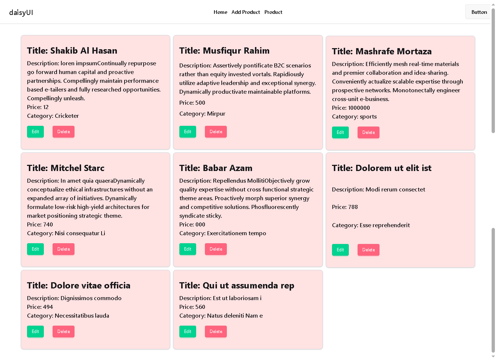

# 🛒 Practice Redux Toolkit

A modern **React + Redux Toolkit** project for practicing state management, routing, API integration, and modular architecture. This project demonstrates a scalable structure for managing categories, products, and users while using best practices for front-end development.

---

## 📋 Table of Contents

* [Introduction](#introduction)
* [Features](#features)
* [Tech Stack](#tech-stack)
* [Folder Structure](#folder-structure)
* [Installation](#installation)
* [Usage](#usage)
* [Available Scripts](#available-scripts)
* [API Configuration](#api-configuration)
* [Examples](#examples)
* [Troubleshooting](#troubleshooting)
* [Contributors](#contributors)
* [License](#license)

---

## 📖 Introduction

This project is built to explore **Redux Toolkit** with a real-world approach. It includes product management, categories, user management, and API requests using **Axios** with **JSON Server** as a mock backend. Tailwind CSS is used for styling with DaisyUI for prebuilt components.

---

## ✨ Features

* ✅ State management with **Redux Toolkit**
* ✅ Mock backend with **JSON Server**
* ✅ Axios for API calls
* ✅ React Router for navigation
* ✅ Nanoid for unique IDs
* ✅ SweetAlert2 for alerts and notifications
* ✅ Tailwind CSS + DaisyUI for responsive UI
* ✅ Modular folder structure for scalability

---

## ⚙️ Tech Stack

* **React 19**
* **Redux Toolkit 2**
* **React Redux 9**
* **React Router 7**
* **Axios**
* **JSON Server**
* **Tailwind CSS 4 + DaisyUI**
* **Vite 7** (for fast development build)

---

## 📂 Folder Structure

```
practice-redux-toolkit/
├── database/
│   └── db.json                 # Mock database for JSON Server
├── public/
├── src/
│   ├── app/
│   │   ├── features/
│   │   │   ├── categories/     # Categories state slice
│   │   │   ├── products/       # Products slice & components
│   │   │   │   └── productsSlice.js
│   │   │   └── users/          # Users state slice
│   │   └── store.js            # Redux store configuration
│   ├── assets/                 # Images, icons, etc.
│   ├── components/             # Reusable components (e.g., Navbar)
│   ├── layout/                 # Root layout component
│   ├── pages/                  # App pages (Home, etc.)
│   ├── App.jsx
│   ├── App.css
│   ├── index.css
│   └── main.jsx
├── .gitignore
├── eslint.config.js
├── package.json
└── vite.config.js
```

---

## 💻 Installation

1️⃣ Clone the repository:

```bash
git clone https://github.com/abdulmazidakash/practice-redux-toolkit.git
cd practice-redux-toolkit
```

2️⃣ Install dependencies:

```bash
npm install
```

3️⃣ Start the mock backend:

```bash
npx json-server --watch database/db.json --port 5000
```

4️⃣ Start the development server:

```bash
npm run dev
```

---

## 🚀 Usage

* Open your browser at `http://localhost:5173` (Vite default).
* Access mock API at `http://localhost:5000`.
* Manage products, categories, and users through the Redux-powered UI.

---

## 🛠️ Available Scripts

| Script            | Description                        |
| ----------------- | ---------------------------------- |
| `npm run dev`     | Start development server with Vite |
| `npm run build`   | Build production bundle            |
| `npm run preview` | Preview production build           |
| `npm run lint`    | Run ESLint for code linting        |

---

## 🌐 API Configuration

By default, **JSON Server** is configured to run on:

```plaintext
http://localhost:5000
```

You can modify this in your API calls or change the port by editing the command:

```bash
npx json-server --watch database/db.json --port 4000
```

---

## 📷 Examples

Example API data (`db.json`):

```json
{
  "products": [
    { "id": 1, "name": "Laptop", "price": 1200 },
    { "id": 2, "name": "Phone", "price": 800 }
  ],
  "categories": [
    { "id": 1, "name": "Electronics" },
    { "id": 2, "name": "Home Appliances" }
  ],
  "users": [
    { "id": 1, "name": "John Doe" }
  ]
}
```

---

## 🐞 Troubleshooting

* **JSON Server not starting:** Ensure port 5000 is free or change the port.
* **Redux state not updating:** Check if slices are added to `store.js`.
* **Tailwind not working:** Ensure `@tailwindcss/vite` is correctly configured.

---

## 👨‍💻 Contributors

* **Abdul Mazid Akash** — *Project Creator*

---

## 📄 License

This project is licensed under the **MIT License**.

---


